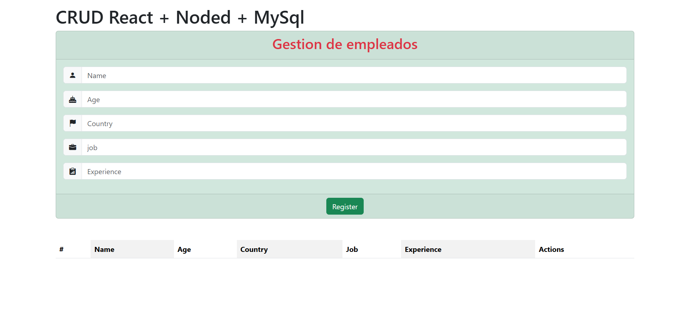

# CRUD COMPLETO 📘 React JS + 📗 Node JS + 📒 MySQL + 🖌️ Bootstrap 5

Este proyecto es un CRUD completo para gestionar empleados, utilizando tecnologías modernas tanto en el frontend como en el backend.


> Interfaz principal del CRUD de empleados
---

## 🧰 Tecnologías utilizadas

### ⚙️ Backend
- Node.js
- Express.js

### 🗄️ Base de datos
- MySQL

### 🎨 Frontend
- React.js
- Bootstrap 5

---

## 🚀 Funcionalidades

- Crear, leer, actualizar y eliminar empleados
- Conexión a base de datos MySQL
- Interfaz responsiva con Bootstrap 5
- Arquitectura modular y escalable


## 📦 Paquetes Instalados

### 🖥️ Cliente (React + Vite)

```bash
npm create vite@latest
npm install bootstrap@5.3.7
npm install sweetalert2
npm install axios
```

### ⚙️ Backend

````bash
npm install express
npm install cors
npm install mysql
```
